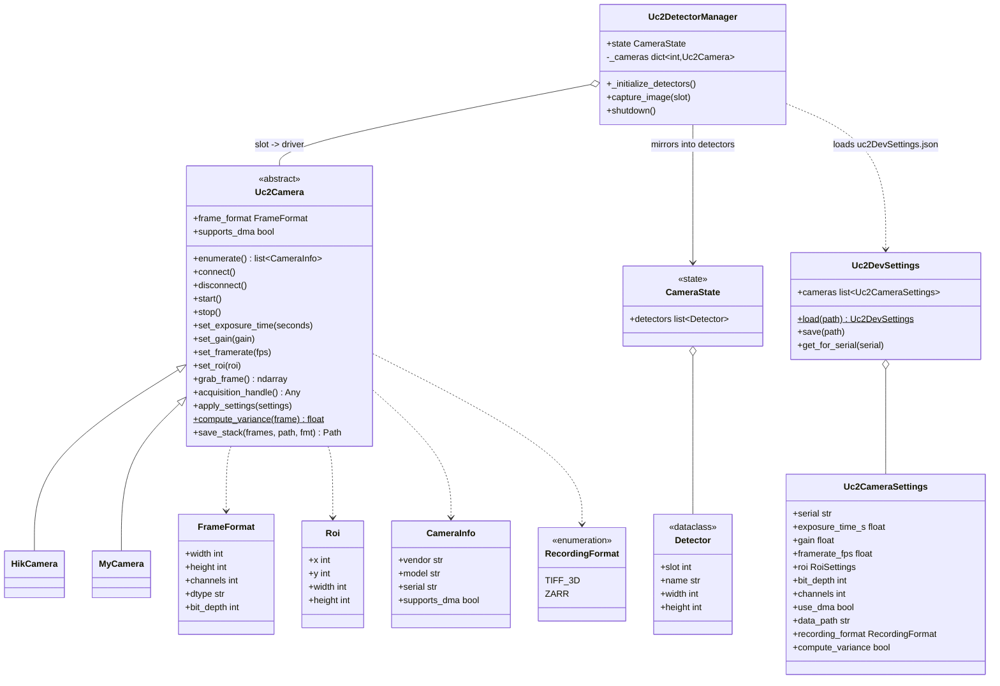

# uc2_devices

A small, SDK-only **camera driver layer** for newswitch-py. It gives every UC2
camera (HIKROBOT, Basler, Allied Vision, …) a single, uniform interface so the
rest of newswitch-py never has to know which vendor is behind a given detector.

---

## Where it fits

newswitch-py follows a **Protocol → Manager → State** pattern. This package sits
one level *below* the managers: it is the concrete hardware-control layer that a
`Uc2DetectorManager` **composes** with the rekuest `Detector` dataclass and
`CameraState`.

Two boundaries are important:

- **Control lives in Python, the frame data does not.** Connecting, setting
  exposure/gain/framerate/ROI and start/stop happen here. The high-throughput
  frame stream (full-rate live view + recording) runs in the **native C++
  engine**; this layer only *configures* it, *starts/stops* it and *reports
  capabilities* (DMA, pixel format). `grab_frame()` is for snapshots and
  moderate-rate captures only.
- **ROI is applied on the camera / in the native layer**, never cropped
  per-frame in Python.

---

## Structure



**Reading the diagram:** concrete drivers (`HikCamera`, `MyCamera`) inherit the
abstract `Uc2Camera`. The `Uc2DetectorManager` holds a `slot -> driver` map and
mirrors each driver's capabilities into a plain `Detector` inside the synced
`CameraState`. Drivers are configured from `uc2DevSettings.json`.

---

## Module layout

| File | Responsibility |
|------|----------------|
| `uc2_camera.py` | The `Uc2Camera` ABC + value types (`FrameFormat`, `Roi`, `CameraInfo`, `RecordingFormat`). Shared logic: `apply_settings`, `compute_variance`, `save_stack`, context manager. |
| `settings.py` | `uc2DevSettings.json` model (`Uc2DevSettings`, `Uc2CameraSettings`, `RoiSettings`) with `load`/`save`. |
| `hik_camera.py` | HIKROBOT (MVS SDK) driver skeleton — vendor-specific methods to fill in. |
| `__init__.py` | Public exports. |
| `core/include/Ringbuffer.hpp`, `core/src/Ringbuffer.cpp` | **Native frame ring buffer** — the full-rate frame path (see below). |
| `core/` (`MvsCamera`, `CaptureApp`, `ImageWindow`, `MvsError`) | HIKROBOT capture engine (C++), used by the `_hikcam` binding. |
| `bindings/hikcam_py.cpp`, `bindings/ringbuffer_py.cpp` | pybind11 modules `_hikcam` and `_ringbuffer` (read-only view of the buffer). |
| `tests/` | C++ test suite for the ring buffer + a pytest smoke test for the binding. |

### Why an ABC (not a `Protocol`)?

The managers in newswitch-py use `Protocol` because they only describe an
interface. Camera drivers, in contrast, share **real logic** — variance,
TIFF/Zarr saving, settings application, lifecycle — so an **abstract base class**
lets that code live once and be inherited. Only the vendor-specific methods are
`@abstractmethod`.

### Composition, not inheritance, for the data side

A driver (`HikCamera`) is **not** a `Detector`. `Detector` is a serializable
data mirror that goes to the frontend; the driver talks to hardware. The
`Uc2DetectorManager` connects the two by composition: `slot -> driver` for
control, `Detector` in `CameraState.detectors` for the synced view.

---

## Key concepts

- **Arbitrary bit depth & channels.** `FrameFormat` separates `bit_depth`
  (significant bits: 8/10/12/14/16/32/64…) from `dtype` (storage:
  uint8/uint16/uint32/float32/float64…). `channels` is any integer
  (1 = mono, 3 = RGB, N = multispectral).
- **DMA-aware.** `CameraInfo.supports_dma` reports the capability;
  `acquisition_handle()` returns a DMA/pinned buffer (zero-copy) or a copy
  grabber. The native engine branches on `supports_dma`.
- **ROI in hardware / native.** `set_roi(roi)` pushes the ROI to the camera or
  native layer; it is applied at readout, not in Python.
- **Recording formats.** `save_stack(...)` writes 3D-TIFF or Zarr, selected via
  `RecordingFormat`. This is the snapshot / moderate-rate writer — sustained
  full-rate recording is the native writer thread's job.
- **Settings.** All of the above are configured per camera (keyed by serial) in
  `uc2DevSettings.json`.

---

## Usage

### 1. `uc2DevSettings.json`

```json
{
  "cameras": [
    {
      "serial": "HIK-000123",
      "name": "top camera",
      "slot": 1,
      "exposure_time_s": 0.01,
      "gain": 1.0,
      "framerate_fps": 30.0,
      "roi": { "x": 0, "y": 0, "width": 2048, "height": 2048 },
      "bit_depth": 12,
      "channels": 1,
      "use_dma": true,
      "data_path": "/data/uc2",
      "recording_format": "zarr",
      "compute_variance": false
    }
  ]
}
```

### 2. Use a camera directly

```python
from newswitch.uc2_devices import HikCamera

info = HikCamera.enumerate()[0]          # discover
with HikCamera(info) as cam:             # __enter__ -> connect()
    cam.set_exposure_time(0.01)
    frame = cam.grab_frame()             # snapshot
    print(cam.describe())
    cam.save_stack(frame[None], "snap.tif", fmt="tiff_3d")
```                                      # __exit__ -> disconnect()

### 3. Inside the manager

```python
infos = sorted(HikCamera.enumerate(), key=lambda i: i.serial)  # deterministic slots
for slot, info in enumerate(infos, start=1):
    cam = HikCamera(info); cam.connect()
    cs = settings.get_for_serial(info.serial)
    if cs:
        cam.apply_settings(cs)           # push JSON settings onto the camera
        slot = cs.slot or slot
    self._cameras[slot] = cam
    f = cam.frame_format
    self.state.detectors.append(
        Detector(slot=slot, name=info.model, width=f.width, height=f.height,
                 data_type=f.dtype)
    )
```

---

## Adding a new camera (simple example)

Three steps: **(1)** subclass `Uc2Camera` and fill the abstract methods with your
SDK calls, **(2)** add a settings block in `uc2DevSettings.json`, **(3)** point
the manager at your driver.

Here is a complete, minimal driver — a **mock camera** that produces synthetic
frames. Replace the bodies with real SDK calls for a real device; the structure
stays identical.

```python
import numpy as np
from newswitch.uc2_devices import Uc2Camera, CameraInfo, FrameFormat

class MockCamera(Uc2Camera):
    # --- discovery ---
    @classmethod
    def enumerate(cls):
        return [CameraInfo(vendor="ACME", model="MockCam", serial="MOCK-001")]

    # --- lifecycle ---
    def connect(self):    self._connected = True
    def disconnect(self): self._connected = False
    def start(self):      self._running = True
    def stop(self):       self._running = False

    # --- parameters ---
    def set_exposure_time(self, seconds): self._exp = seconds
    def set_gain(self, gain):             self._gain = gain
    def set_framerate(self, fps):         self._fps = fps
    def set_roi(self, roi):               self._roi = roi   # keep get_roi() consistent

    # --- frames ---
    def grab_frame(self):
        return np.random.randint(0, 65535, size=(512, 512), dtype="uint16")

    def acquisition_handle(self):
        return None   # a real camera returns a DMA/copy handle for the native engine

    # --- capabilities ---
    @property
    def frame_format(self):
        return FrameFormat(width=512, height=512, channels=1,
                           dtype="uint16", bit_depth=16)

    @property
    def is_connected(self): return getattr(self, "_connected", False)
    @property
    def is_running(self):   return getattr(self, "_running", False)
```

Use it exactly like any other driver — `compute_variance`, `save_stack`,
`apply_settings` and the `with` context manager come for free from the base:

```python
info = MockCamera.enumerate()[0]
with MockCamera(info) as cam:
    frame = cam.grab_frame()
    print(cam.describe(), "->", frame.shape)
    print("variance:", cam.compute_variance(frame))
    cam.save_stack(frame[None], "mock.zarr", fmt="zarr")
```

That is the whole contract: implement the abstract methods, and the shared
behaviour is inherited.

---

## Lifecycle notes

- **Deterministic slots.** Assign slots from a stable key (sorted serial, or a
  fixed `slot` in settings) so a restart doesn't move a camera to a different
  slot.
- **Clean shutdown.** Give the manager a `shutdown()` that iterates its cameras
  and calls `disconnect()`, and wire it into the rekuest `lifespan` in
  `provide_managers`, so no SDK handles leak.
- **Don't route the fast path through Python.** `grab_frame()` is for snapshots.
  The full-rate stream is owned by the native engine via `acquisition_handle()`.

---

## Native frame ring buffer (C++ engine)

`grab_frame()` is the snapshot path. The **full-rate** frame path — grabbing at
up to ~1 GB/s on a Raspberry Pi 5 without dropping frames — runs in the native
`uc2::RingBuffer` ([`core/include/Ringbuffer.hpp`](core/include/Ringbuffer.hpp),
[`core/src/Ringbuffer.cpp`](core/src/Ringbuffer.cpp)). It is a **single-writer /
multi-reader** ring of frame slots, deliberately independent of any camera SDK
(only the C++ standard library + optional ARM NEON), so it can be unit-tested and
reused anywhere.

### Design in one paragraph

The **write path is sacred**: the camera thread only validates the ROI and does a
(row-wise) `memcpy`, nothing else — anything heavier would fight the camera for
memory bandwidth and drop frames. Everything expensive (channel de-interleave,
the per-channel image norm, chunked disk saving) runs afterwards on a
lower-priority **worker thread**. Producer, worker and readers coordinate with no
global lock: every slot carries a `std::atomic<FrameState>` and there is one
atomic "last ready" index.

### Frame lifecycle

```
                writeToBuffer()                 worker (norm / rearrange / save)
   Ready ───────────────────────▶ Writing ───────────────▶ Postprocessing ──▶ Ready
     ▲   (producer memcpy's ROI)            (producer moves on)                  │
     │                                                                          │
     └──────────────── read() / readMetaData() take Ready ─▶ Reading ─▶ Ready ──┘
```

| State | Meaning |
|-------|---------|
| `Writing` | Producer owns the slot; nobody else may touch it. |
| `Postprocessing` | Committed; the worker is computing the norm / de-interleaving / snapshotting it for disk. **Not yet readable**, but the producer can already write the next frame. |
| `Ready` | Fully available for reading. Unwritten slots start here (zero-filled), so a never-written frame reads back as zeros. |
| `Reading` | A reader is briefly copying the slot out. |

Readers take a slot with an atomic `Ready → Reading` compare-exchange, copy it
into a **fresh, owned buffer**, then release it back to `Ready`. Because the
producer also needs `Ready` to reuse a slot, reads and writes can never tear the
same frame; when a slot is busy the producer applies its blocked strategy.

### Configuration (constructor properties)

All properties from the requirement, in one `RingBufferConfig` (the Python
binding takes them as keyword arguments, shown in the last column):

| Property | Type | Python kwarg | Meaning |
|----------|------|--------------|---------|
| name | string | `name` | Data-set name (stored in the save-file header). |
| bufferSize | uint32 | `buffer_size` | Number of frame slots in the ring. |
| ROI | rect | `roi_row_offset`, `roi_col_offset`, `roi_height`, `roi_width` | Window copied from each incoming image. **Also defines the stored frame size** (so `width`/`height` must be > 0; for a full frame, pass the full dimensions). |
| ByteSize | uint | `byte_size` | Bytes per sample: `1`, `2`, `4` or `8`. |
| Channel count | uint | `channel_count` | Channels per pixel (1 = mono, 3 = RGB, N = multispectral). |
| rearrangeChannels | bool | `rearrange_channels` | If true, the worker de-interleaves pixel-interleaved `(H,W,C)` data into planar `(C,H,W)` so each channel reads back contiguously (NEON `vldN` fast path on ARM). |
| imageNorm | enum | `image_norm` | Per-channel reduction computed by the worker: `None_`, `Variance`, `Max`, `Min`, `Mean`, `Median`. |
| SaveFilePath | string | `save_file_path` | RAW output path; empty ⇒ no saving. |
| SaveFileChunkSize | uint32 | `save_file_chunk_size` | Frames accumulated before one disk flush. |
| strategyIfFrameIsBlocked | enum | `strategy_if_frame_is_blocked` | `Wait` (block until the slot frees) or `Jump` (skip to the next writable slot). |

Additional settable property (not a constructor arg): `indexOfLastReadyFrame`
(Python: `index_of_last_ready_frame`, read-only) — the index of the last frame
whose writing **and** post-processing finished, or `-1` if none yet.

### API

**Producer (C++/camera side only — never exposed to Python):**

- `writeToBuffer(src, srcWidth, srcHeight, srcChannels, srcByteSize, frameNumber)`
  — validate the ROI against the incoming dimensions (rejects null / mismatched
  format / out-of-bounds ROI so a bad frame can't cause a buffer overrun), copy
  the ROI into the next slot, and hand it to the worker.

**Readers (exposed to Python as the `_ringbuffer` module):**

| C++ | Python | Returns |
|-----|--------|---------|
| `read(index)` | `read(index)` | Owned copy of the frame + geometry — a numpy `(H,W)` / `(H,W,C)` array (or `(C,H,W)` if de-interleaved), or `None`/invalid if blocked. |
| `readLastReady()` | `read_last_ready()` | Same, for the newest ready frame (realtime "drop-old" semantics). |
| `readMetaData(index)` | `read_metadata(index)` | Timestamps + per-channel norm. |
| `readMetaDataLastReady()` | `read_metadata_last_ready()` | Same, for the newest ready frame. |

**Runs internally on the worker (not callable from outside):** computing the
image norm and, when `SaveFilePath` is set, streaming full chunks to disk.

### On-disk RAW format

When saving is enabled the file begins with a `FileGlobalHeader` (magic
`UC2RBUF1`, version, all constructor properties incl. name/ROI/byteSize/channels/
norm/chunkSize), followed by one record per frame: a `FileFrameHeader`
(frame count, start/stop timestamps, channel count, planar flag), then
`float norm[channels]`, then the raw image bytes. Both structs are declared in
`Ringbuffer.hpp` so a decoder can reuse the exact layout.

### Notes for LiveKit

`read`/`readLastReady` return an **owning** copy (safe to keep after the slot is
recycled) with monotonic timestamps and newest-frame semantics — everything
LiveKit's realtime path wants. The one remaining step before publishing is a
pixel-format / bit-depth conversion to an 8-bit LiveKit layout (I420 or RGBA);
do that after `read`, in Python (numpy/opencv) or a small C++ helper.

### Running the tests

The C++ suite covers the full write path (ROI, de-interleave, every norm,
disk save, blocked strategies, concurrency); the pytest smoke test covers the
read-only binding surface. The ring buffer needs **no camera SDK**, so:

```bash
# C++ functional + concurrency suite (standalone, no MVS SDK needed)
cmake -S newswitch/uc2_devices/tests -B build-rbtests
cmake --build build-rbtests
ctest --test-dir build-rbtests --output-on-failure

# Python binding smoke test (skips automatically if the _ringbuffer
# extension has not been built into the environment)
pytest newswitch/uc2_devices/tests/test_ringbuffer_py.py
```

For race-detection, build the suite with `-fsanitize=thread` — it runs clean
under ThreadSanitizer (concurrent readers + writer + saving + rearrange).

---

## Dependencies

`numpy`, plus `tifffile` and `zarr` for `save_stack` (all already in the
newswitch-py environment). Vendor SDKs (e.g. HIKROBOT MVS) are required only by
the concrete driver that uses them. The native modules (`_hikcam`,
`_ringbuffer`) are built by pybind11 via scikit-build-core during the wheel
build; `_ringbuffer` itself is SDK-independent (only needs a C++14 compiler and
threads).
